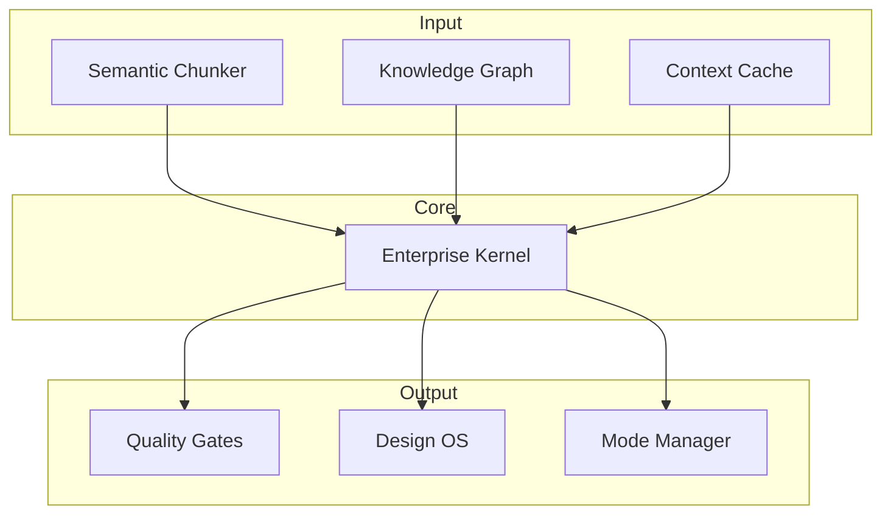

# System Architecture

## High-Level Diagram



## Module Dependencies

```text
rlm_lib/
├── kernel.py              # Base RLM kernel
├── kernel_enterprise.py   # Enterprise kernel (extends base)
├── semantic_chunker.py    # AST-aware chunking
├── knowledge_graph.py     # Entity/relationship graph
├── context_cache.py       # Persistent caching
├── quality_gate.py        # Quality validation
├── confidence_scorer.py   # Confidence calculation
├── design_os_adapter.py   # Design system integration
├── review_orchestrator.py  # Multi-agent review
└── validators/            # Validation modules
```

See [[Core Modules]] for detailed component descriptions.
