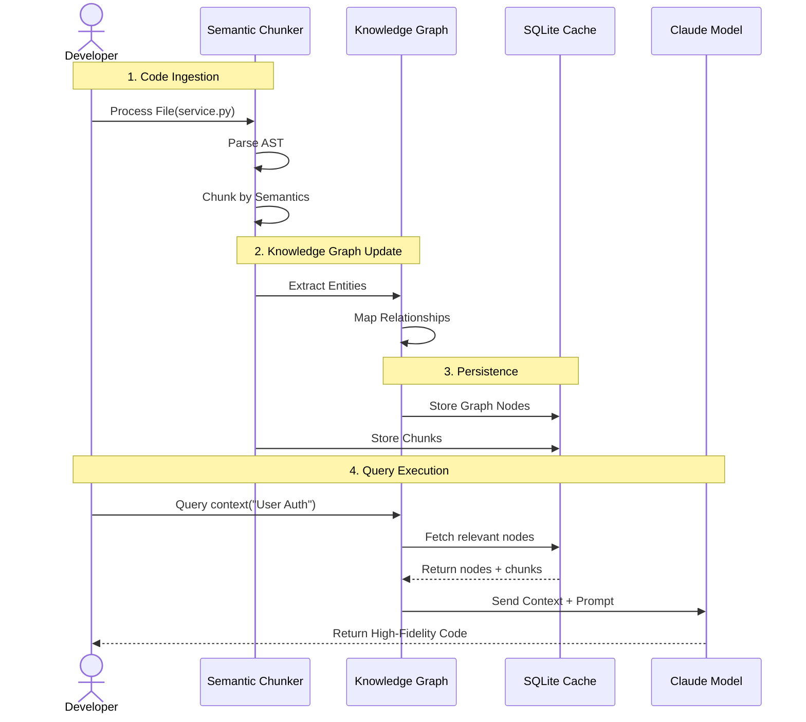

# Core Modules

## Data Flow Overview

```mermaid
sequenceDiagram
    %% Styling
    actor Dev as Developer
    participant SC as Semantic Chunker
    participant KG as Knowledge Graph
    participant DB as SQLite Cache
    participant LLM as Claude Model
    
    Note over Dev, SC: 1. Code Ingestion
    Dev->>SC: Process File(service.py)
    SC->>SC: Parse AST
    SC->>SC: Chunk by Semantics
    
    Note over SC, KG: 2. Knowledge Graph Update
    SC->>KG: Extract Entities
    KG->>KG: Map Relationships
    
    Note over KG, DB: 3. Persistence
    KG->>DB: Store Graph Nodes
    SC->>DB: Store Chunks
    
    Note over Dev, LLM: 4. Query Execution
    Dev->>KG: Query context("User Auth")
    KG->>DB: Fetch relevant nodes
    DB-->>KG: Return nodes + chunks
    KG->>LLM: Send Context + Prompt
    LLM-->>Dev: Return High-Fidelity Code
```

## 1. Semantic Chunker (`semantic_chunker.py`)

...
