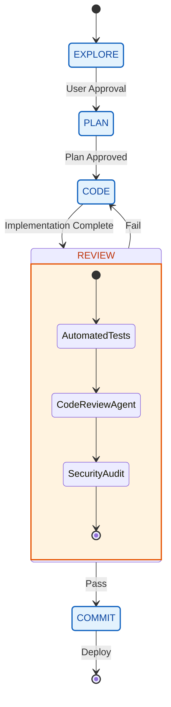

# Mode Management

## 11. Review Orchestrator (`review_orchestrator.py`)

**Purpose**: Coordinate multiple review agents for comprehensive code review.

**Agents**:

- `CodeReviewAgent`: General code quality
- `SecurityAuditAgent`: Vulnerability detection

**Usage**:

```python
orchestrator = create_review_orchestrator()
result = orchestrator.review(code)
```

## 13. Mode Manager v2

**Purpose**: Enterprise workflow management with strict mode transitions.



**Modes**:

- `EXPLORE`: Research and understanding
- `PLAN`: Solution design
- `CODE`: Implementation
- `REVIEW`: Verification and testing
- `COMMIT`: Finalization

Transitions between modes are gated by quality checks and human approval.
